# Cockhouse brand

> **Cockhouse is the weird, warm little house on the internet where your people hang out.**

When a design question comes up, check the answer against that sentence first.

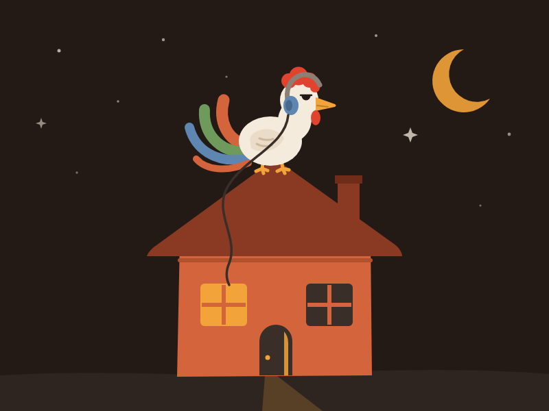

## The idea

The name is unserious and the product is serious. The design sits between the two.

"Cockhouse" can be read two ways: a house with a rooster in it, or the obvious joke. The rooster gives the name an honest meaning, and the joke is something people notice and smile at. It must never become the whole brand. The ideal reaction is "Cockhouse? that's stupid", then five seconds later, "...actually, that's kind of perfect."

The joke lives in the **name**. The logo, the illustrations and the interface should hold up for someone who has never heard it.

Cockhouse should feel warm, playful, a little irreverent, confident, internet-native, cozy and a bit weird. It should not feel corporate, like enterprise SaaS, childish, edgy for its own sake, sexual, crypto, "AI startup", or like a Discord clone. Stay away from the visual language of Discord, Slack, Teams, Zoom, Linear and Notion.

The central image is **a house for your flock**. The app is a place: spaces are houses, channels are rooms, and people come and go. Use that as a light layer of personality. Don't force it onto every element.

## Logo

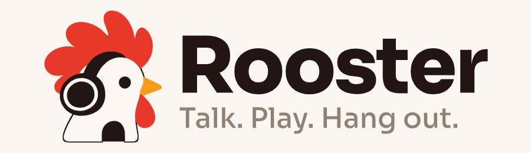

The mark is a dark house with a rooster looking out of it, wearing headphones: it is in a call. The comb is four big rounded lobes fanning back from the crown, the front one tallest, and it grows out of the head rather than floating above it. The white head fills the lower half. The ear cup sits on the cheek behind the eye, and the band curves up out of it and forward over the crown. A chimney sits beside the ridge, and the door opens at the bottom of the rooster's neck. It reads as "a house" at a glance and as "a rooster's house" a second later. The joke stays in the name.

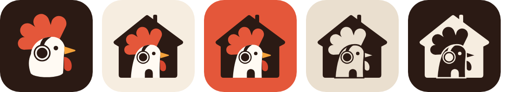

The mark comes in five forms:

1. **The rooster alone on hearth brown.** For dark backgrounds, where a dark house would disappear. It is also the dark-mode splash and the dark lockup.
2. **The house on eggshell.** This is the app icon, and the default everywhere.
3. **The house on comb red.** For loud moments: stickers, event banners, the store feature graphic.
4. **One colour, dark.** The house with the rooster cut out of it. For stamps, embossing and single-ink printing.
5. **One colour, reversed.** The same cut-out in eggshell on hearth brown. Android's themed icon and status-bar icon use this form.

| Horizontal | Stacked | One colour |
|---|---|---|
| 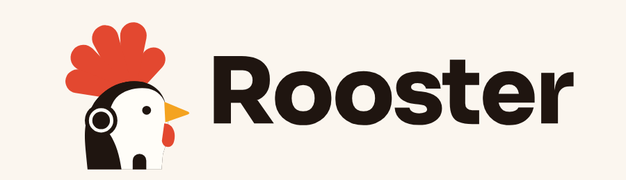 | 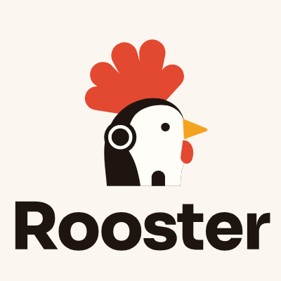 | 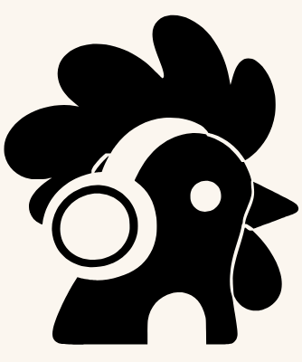 |

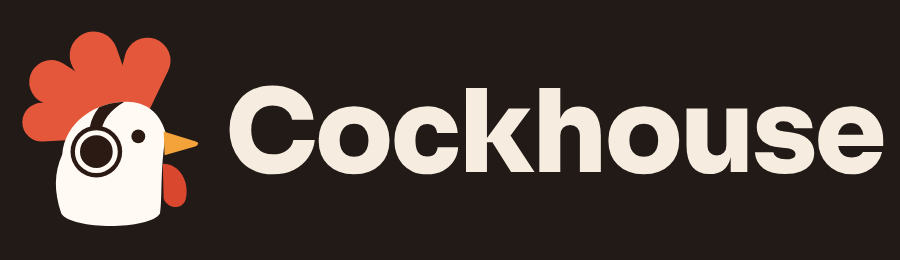

**Small sizes.** The mark is simple enough to use unchanged down to 16 px. Below 48 px, the tile's margin shrinks so the house fills more of it.

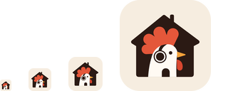

**Don'ts.** Don't redraw the mark into anything phallic, put the dark house on a dark background (use the rooster alone), recolour the comb away from comb red (except in one-colour use), add gradients or shadows, or stretch it. Keep clear space around it of at least the comb's height.

### Files

| File | Use |
|---|---|
| `logo/app-icon.svg`, `logo/app-icon-1024.png` | App stores, social avatars, the GitHub org |
| `logo/app-icon-dark.svg`, `logo/app-icon-comb.svg` | The rooster on hearth brown; the house on comb red |
| `logo/mark.svg` | The mark alone, full colour, for light backgrounds |
| `logo/rooster.svg` | The rooster alone, for dark backgrounds |
| `logo/mark-mono.svg` | One colour (`currentColor`), the rooster cut out |
| `logo/wordmark-on-*.svg` | "Cockhouse", outlined |
| `logo/lockup-*.svg` | Mark and name: horizontal, with tagline, stacked, and on dark |
| `merch/tee-*.svg` | Print-ready shirt graphic |
| `illustrations/roof-rooster.svg` | Hero illustration |
| `illustrations/motifs.svg` | UI motif sketches |

Everything in `logo/` and `merch/`, and every platform icon in `commet/`, is generated by [`src/build_brand.py`](src/build_brand.py). Change the geometry there, not in the output:

```sh
python3 -m venv /tmp/brand && /tmp/brand/bin/pip install fonttools
/tmp/brand/bin/python docs/brand/src/build_brand.py            # docs/brand only
/tmp/brand/bin/python docs/brand/src/build_brand.py --install  # plus the app's icons
```

It needs `google-chrome` (for rasterising) and ImageMagick's `convert` on the PATH. `--install` writes:

- the Flutter assets;
- web favicons, PWA and maskable icons, and the web splash (the rooster alone for dark, the house for light);
- the Windows `.ico` and the tray's idle icon;
- the Linux hicolor and Flatpak icons;
- the Android launcher icons, adaptive foreground, themed monochrome and notification icons, and the adaptive background colour.

## Colour

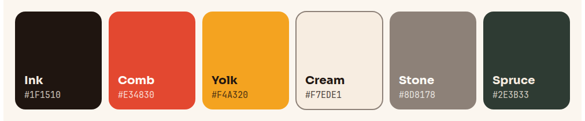

The palette is warm and lived-in: hearth, walnut and eggshell for the house, then comb red, ember and yolk for the rooster. Moss, pine and dusk are for the rare moments that need green or blue.

| Name | Hex | Role |
|---|---|---|
| Hearth | `#2B1A14` | The house, the dark tile, text on light |
| Walnut | `#6B3A22` | Wood, warm dark accents in illustration |
| Timber | `#3D2A22` | Dark raised surfaces, lines on dark |
| Ash | `#5F5557` | Secondary text, the tagline |
| Plaster | `#EADFCF` | Light containers |
| Eggshell | `#F6EDE0` | The app-icon tile, light background, text on dark |
| Comb | `#E4573A` | The comb, and the primary accent: buttons, selection, focus, hang up |
| Ember | `#E8813A` | Warm secondary accent |
| Yolk | `#F6B65A` | Lit windows, highlights, away |
| Moss | `#5E8F4E` | Online, speaking, success |
| Pine | `#2F5B4B` | Forest and night scenes |
| Dusk | `#3F4F6E` | Info, quiet accents |

The rooster itself is `#FFFAF3`, with a `#F4A23A` beak and a `#D9472F` wattle. Its headphones are hearth with a feather-white ring.

Rules:

- **Comb red is the one loud colour.** Use it for the primary action and the comb. Don't flood whole screens with it.
- **No purple, no SaaS blue, no gradients.** Flat colour.
- **Dark mode comes first.** It is designed first and checked first.

In the app, the built-in themes (`tiamat/lib/config/style/theme_dark.dart`, `theme_light.dart`) use:

| Role | Dark | Light |
|---|---|---|
| Foundation (behind panels) | `#1B1613` | `#E4D7C6` |
| Surface | `#2A221E` | `#FBF6EF` |
| Container lowest / low / normal / high | `#161210` `#1F1916` `#241D1A` `#362C27` | `#FFFCF7` `#F6EFE5` `#F0E7DA` `#E9DECF` |
| Text | `#F5EBDD` | `#231A16` |
| Primary / on primary | `#E4573A` / `#FFF7EE` | `#C9452B` / `#FFFFFF` |
| Links | `#8FB4DA` | `#3D6B98` |

By day the primary is a little deeper (`#C9452B`), so the label on a filled button keeps at least 3:1 contrast in both themes. `unit_test/filled_icon_button_contrast_test.dart` checks this. Don't lighten the dark primary: cream labels drop below 3:1 fast. The AMOLED and "follow system colours" themes are left as they were.

## Typography

- **Sora** (`commet/assets/font/sora`, OFL, variable): the wordmark in ExtraBold (800, slightly tightened), and display and marketing headlines. It is contemporary and friendly, with rounded bowls, and it looks good in both cases.
- **Nunito Sans** (bundled, variable): headings and UI emphasis in the app.
- **Roboto**: body text, as the app has it today.
- **JetBrains Mono**: code.

**Writing the name.** Write "Cockhouse", capitalised, in running text, titles and the wordmark. Merch can use caps (COCKHOUSE). The tagline is *Your crew's place on the internet.*, in Sora Medium and Ash.

## Illustration

The style is indie internet culture, a cozy clubhouse and a slightly absurd mascot. Use simple shapes, strong silhouettes, flat palette colours and a little wobble. Imperfection is welcome.

The rooster is characterful and a bit scruffy. It is confident and friendly, and a little stupid in an endearing way. It is not a farm logo, a fighting cock, or a children's cartoon. The humour comes from the situation it is in: sitting on the roof at 2 AM in headphones with the cable running down into the window, DJing, sitting at a campfire, staring at a screen, talking into a mic, chilling with other roosters.

Avoid people shaking hands, floating blobs, isometric offices, gradient landscapes, glassmorphism and stock photos. Never draw anything sexual.

## Icons and motifs

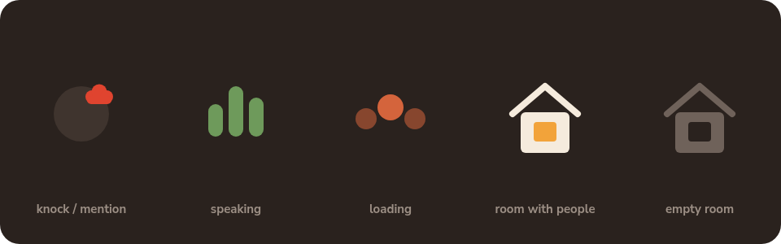

UI icons are rounded, slightly chunky, highly legible and consistent (Material Symbols Rounded suits this). Two brand motifs recur, sparingly:

- **The comb.** Three lobes. It can shape a mention or knock badge, a speaking meter (three rounded bars), a loading indicator (three dots taking turns), or a separator ornament. Don't use the whole rooster silhouette as an icon.
- **The lit window.** A small house with its window lit in yolk means someone is there. With the lights off, the room is empty. Good for voice-room occupancy.

## Motion

Motion should be lively and organic, never flashy.

- The lights come on in a room when someone joins, and fade when the last person leaves.
- Sound-wave and speaking indicators move like voices, not metronomes.
- The rooster in the doorway can glance around when a room becomes active. Once, briefly.
- The DJ booth gets more energy than anything else.
- Short easing (150 to 250 ms), no bouncy overshoot on functional UI, and respect reduced-motion settings.

## Voice and copy

Cockhouse talks like a person talking to their friends. It is for **people**, not users. Groups are **crews**, **groups** or **flocks**, depending on context.

Good: *Your people are here.* · *Come hang out.* · *Your house. Your rules.* · *Bring the whole flock.* · *Pull up a chair.* · *Come on in.* · *See you in the house.* · *Stay a while.* · *Make yourself at home.* · *Your crew's place on the internet.*

Never: *Revolutionizing community communication.* · *Enterprise-grade communication for modern teams.* · *Seamless omnichannel communication.*

**Humour is seasoning.** Most interface text should stay plain and functional: "Mute", "Leave call" and "Upload failed, try again" are correct. Personality belongs in empty states, welcomes and small moments:

| Moment | Copy |
|---|---|
| Login | Come on in. |
| New room | Welcome to #room! Make yourself at home. |
| Empty voice room | It's quiet in here. Pull up a chair. |
| Alone in a call | You're alone in the house. |
| Nobody online | Everyone's out. |
| Someone pings you | Someone's at the door. / Knock knock. |
| Joining a server | Join the house. |

The humour works on three levels:

1. **Normal.** You can use Cockhouse without noticing the joke: "I'm in the house."
2. **Playful.** Rooster references for people who know the brand: "The flock is online."
3. **Cheeky.** Only in marketing, Easter eggs, merch and community jokes: "Welcome to the Cockhouse."

Level 3 never appears in the product's core UI. The brand has to sit comfortably on GitHub, Hacker News, Reddit, in app stores and at conferences without looking like a novelty app.

## Merch

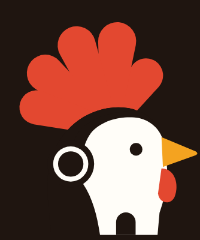

Merch can be more irreverent than the product. The flagship is a plain shirt that says **COCKHOUSE** with a little rooster sitting on the roofline over HOUSE. The joke lands on its own. `merch/tee-on-dark.svg` and `tee-on-light.svg` are two-colour (comb in red), and `tee-one-colour.svg` is for single-ink screen printing.

It also works for stickers (the app icon, die-cut), enamel pins (the mark in hearth, comb red and white enamel), caps (the mark embroidered), mugs and hoodies.

## What is renamed, and what is not

The display name is **Cockhouse** everywhere a person sees it: window and tab titles, the login screen, About, the tray, notifications, the Android launcher label, the Windows version info, Linux desktop entries and AppStream metadata, the web manifest, and the translated strings.

Identifiers stay as they are, because changing them would break updates, installed data and packaging:

- App IDs (`chat.commet.commetapp`, the Windows toast AUMID, the D-Bus name)
- Executable and install names (`commet.exe`, `Programs\roscord`, `.roscord-update`)
- Profile and data directories (`roscord/cef/profiles`)
- Release asset names (`roscord-<tag>-<platform>-…`) and the GitHub repo `PondLabs/roscord`

Rename those together, with a migration, if and when the name is final.
